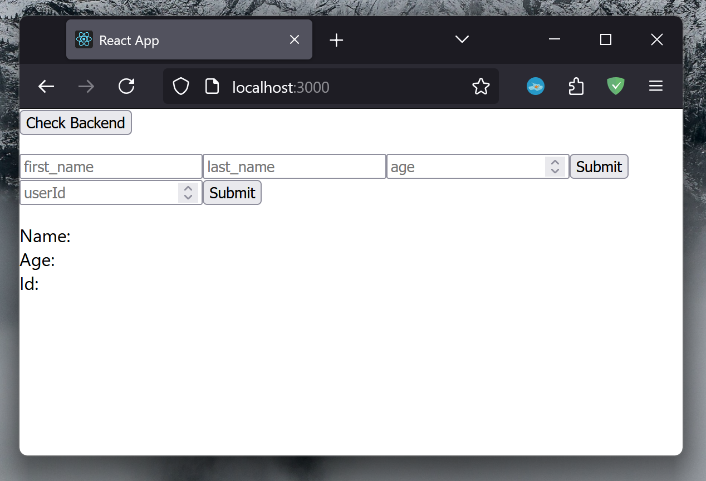

## Instructions

Step by step instructions on cloning and setting up this project.

### Clone GitHub Repo

```bash
git clone https://github.com/adoante/Flask-with-React.git
```

### Setting up conda environment

#### *Install conda*

I recommend and use miniconda. A minimal installer for Conda, a package manager
and environment manager. Please follow Conda's install instructions.

- [Miniconda Install](https://docs.anaconda.com/miniconda/)

#### *Create the envornment*

Located in the project files is a `environment.yml` file. This file
contains all dependencies and allows you to create an enviornment
with them all.

First open the miniconda prompt/terminal, navigate to the git directory and use
the following command.

```bash
conda env create -f environment.yml
```

Now activate the environment using the following command

```bash
conda activate flask-react-sqlalchemy-qai-hub
```

### Setting up the backend

This project uses Flask and SQLalchemy to create an API that accesses and updates a sql database.

Navigate to the `/server` folder. Here you will find two files, `app.py` and `models.py`. `app.py` is our Flask app the API that defines our endpoints and functions. `models.py` is used to initialize our database and define our SQL models.

#### *Initializing the database*

Using the minicoda terminal type the following commands in order.

```bash
flask db init
```

```bash
flask db migrate -m "Initial migration"
```


```bash
flask db upgrade
```

NOTE: Each time the database models change, repeat the migrate and upgrade commands.

If you would like to learn more about these command I recommend reading the
[Flask-Migrate Docs](https://flask-migrate.readthedocs.io/en/latest/index.html).

#### *Start up the backend*

Simply run the following command.

```bash
flask run
```

🎉 Congradulations! 🎉 Your backend should be up and running!

Check your terminal for HTTP link or follow this link http://127.0.0.1:5000/. The sever should be running on `localhost` on port `5000`. The port number is defined in the `app.py` file and can be changed.

#### *Testing the backend*

You should be able to see the text "Hello World!" in your browser. Which means
that flask is running and our `/` endpoint works as well.

Now lets test the endpoint `/api/test`. This endpoint simply returns the
follwoing JSON

```JSON
{
  "message": "Hello from the backend!"
}
```

In your browsers address bar type http://127.0.0.1:5000/api/test. You can also
just click on the link.

### Setting up the frontend

This project uses React.js as the frontend. A `app.js` is provided in the
project files which calls a few of the endpoints in our `app.py` file.

#### *Creating our React app*

First navigate back to the root of our project directory. We'll create a React app using the following command.

The command will create a folder, `/client` that has everything
we need for a React app project.

```bash
npx create-react-app client
```

# TO DO: FIX WHATEVER ACTUALLY CAUSES THIS

#### *Fixing webpack compile errors*

```bash
npm i web-vitals --save-dev
```

#### *Setup communication with our API*

To actually call our API endpoints within our
React app project we first need to configure a 
proxy to our backend.

Open the `package.json` file in the `/client/src/` directory.

After `"private":true` and before `"dependencies": {}` type the following line: `"proxy": "http://localhost:5000/",`

#### *Customizing our frontend index page*

In the `/client/src/` directory there is a file names `app.js`. I have provided
a custom `app.js` file that tests a few of our endpoints.

Simply copy and past the contents into the file.

#### *Start up the front end*

Now lets start up our React app. Use the following command while in the
`/clients` directory.

```bash
npm start
```

🎉 Congradulations! 🎉 Your front should be up and running!

You should now see the following in your browser



#### *Testing our frontend*

Make sure that our backend is running before we begin testing out frontend.
http://127.0.0.1:5000

When you click on `Check Backend` you should see the message "Hello from the backend!".

The first form asks for a First Name, Last Name and Age. Input anything you'd
like. After you press the submit button check the terminal where your Flask
app is running. You should see `{'message': 'posted data'}` appear in the 
terminal.

Now lets get data from out back end. There should only be 1 user in our
database. There id should be 1. Enter 1 in the second form and click submit.
You should see that users data appear.

# 🎉 Congradulations! 🎉

You have succsesfully set up the project! 😄